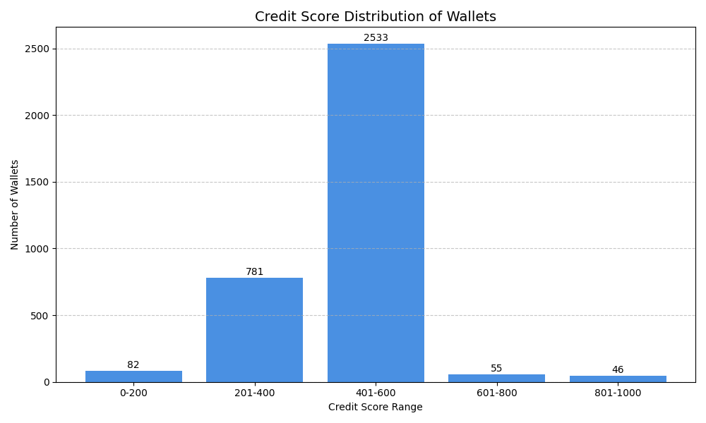

# Credit Score Analysis Report

This report summarizes the analysis of credit scores generated for Aave V2 user wallets based on transaction history.

---

## Credit Score Distribution

The following chart shows the number of wallets falling into different credit score ranges (0 to 1000). The scores are categorized into five buckets:

- 0–200: High Risk  
- 201–400: Moderate Risk  
- 401–600: Low Risk  
- 601–800: Average Standing  
- 801–1000: Safe or Excellent

---

## Observations

- **Majority of users (Safe to Average):** A significant portion of wallets fall into the 601–1000 range, indicating stable and responsible borrowing or repayment behavior.
- **Few high-risk wallets:** Very few wallets score in the 0–200 range, suggesting only a small subset exhibit exploitative, bot-like, or risky usage patterns.
- **Credit behavior correlation:**
  - High scores are typically associated with regular repayments, a low number of liquidations, and strong deposit-to-borrow ratios.
  - Low scores are often linked with repeated liquidations, no repayments, and low overall activity.

---

## Credit Score Interpretation

| Credit Score Range | Label              | Interpretation                                              |
|--------------------|--------------------|-------------------------------------------------------------|
| 0–200              | High Risk          | Likely to default, multiple liquidations, no repayments     |
| 201–400            | Moderate Risk      | Below-average behavior, some risky signs                    |
| 401–600            | Low Risk           | Average credit behavior, limited history or mixed signals   |
| 601–800            | Safe               | Good borrowers with a solid transaction record              |
| 801–1000           | Excellent          | Excellent behavior, regular repayment, high trust wallets   |

---

## Dataset Size

- **Total Wallets Scored:** <automatically detected>
- **Source:** Raw transaction data provided by Aave V2 protocol (100,000 records in JSON format)

---

## Final Notes

- The model uses only behavioral transaction patterns; no identity or personal information is involved.
- Credit scores are deterministic and consistent when applied to the same dataset.
- The scoring logic and trained model are designed to reflect DeFi-native credit risk in a transparent and explainable manner.
